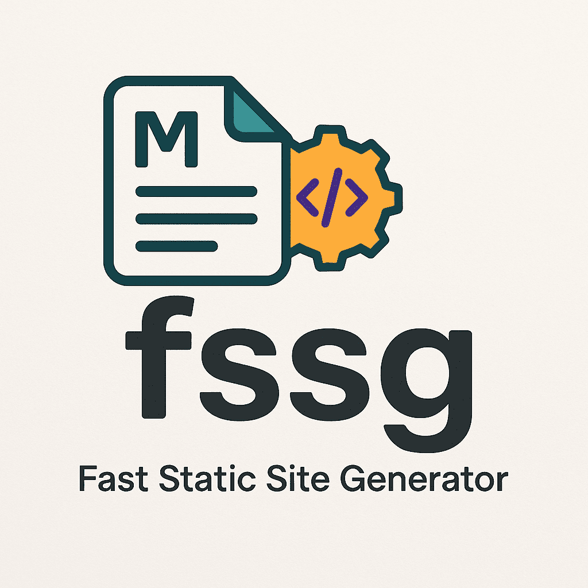

<p align="center">
  <a href="https://github.com/xlc-dev/fssg">
    
  </a>
</p>

<h1 align="center">fssg - Fast Static Site Generator</h1>

<p align="center">
  <em>Blazing Fast. Pure Shell. Zero Fuss.</em>
</p>

<p align="center">
  <a href="https://opensource.org/licenses/MIT">
    
  </a>
  
  <a href="https://github.com/xlc-dev/fssg/stargazers">
    
  </a>
</p>

---

fssg is a minimal, lightning-fast static site generator built entirely with POSIX shell. It transforms Markdown and HTML files into a complete website, applying templates, handling includes, conditionals, and more, with zero complex dependencies.

➡️ **For full details, feature deep-dives, and advanced usage, please visit the [fssg Documentation Website](https://xlc-dev.github.io/fssg/).**

## ✨ Core Features

- 🚀 **Lightning Fast:** Pure POSIX shell for maximum build speed.
- 🪶 **Featherlight & Simple:** No heavy dependencies. Just your shell and content.
- 📄 **Markdown & HTML:** Write content your way.
- 🧩 **Templating Power:** Main page template, simple includes, and parameterized block includes.
- 💡 **Conditional Rendering:** Show/hide content based on output page or source file extension.
- 🔄 **Dynamic Content:** Automated post listings (recent & all) with pagination.
- 💅 **Asset Pipeline:** Static file copying and automatic style/script hoisting & deduplication.
- 🛠️ **Developer Friendly:** Watch mode, built-in dev server, parallel builds, and auto-open in browser.
- 🛡️ **POSIX Compliant:** Ensures broad portability.
- ✂️ **Built-in Markdown Parser:** Handles common Markdown syntax without external tools.

## ⚙️ Prerequisites

- A POSIX-compliant shell (e.g., `sh`, `bash`, `zsh`).
- Standard POSIX utilities (e.g., `awk`, `sed`, `find`, `cp`). (Usually pre-installed).

## 🚀 Getting Started

### 1. Installation

- **Download the script (recommended for most users):**

  ```shell
  wget https://github.com/xlc-dev/fssg/raw/main/fssg
  ```

  Place `fssg` in your project's root directory.

- **Or, clone the repository (for example if you also want `mongoose/ for -s`):**
  ```shell
  git clone https://github.com/xlc-dev/fssg.git
  # Then copy fssg/fssg and fssg/mongoose/ to your project
  cp fssg/fssg ./my-site/
  cp -r fssg/mongoose ./my-site/mongoose/ # If using -s (serve)
  chmod +x ./my-site/fssg
  ```

### 2. Basic Project Structure

```
your-project/
├── fssg                # The generator script
└── src/
    ├── index.md        # Your content (or .html)
    ├── template.html   # Main HTML layout
    └── static/         # (Optional) CSS, images, etc.
        └── style.css
```

(See the [full documentation](https://github.com/xlc-dev/fssg/blob/main/README.md#directory-structure) for more details on structure, includes, etc.)

### 3. Build Your Site

```shell
./fssg
```

Output is generated in the `dist/` directory.

### 4. Development Workflow

For local development with live reload and a server:

```shell
./fssg -j 100 -s -w -o
```

(Requires `mongoose/` for the `-s` option. Adjust `-j` (jobs) as needed.)

## 📖 Core Concepts Overview

fssg works by processing files from your `src/` directory into a static website in `dist/`.

- **Main Template (`src/template.html`):** Defines the overall page structure. Uses `{{content}}` for page-specific content and `{{title}}` for the page title.
- **Content Files (`.md`, `.html`):** Your actual page content. Markdown files are converted to HTML.
- **Includes (`src/includes/`):** Reusable HTML snippets.
- **Conditionals:** Control content visibility based on page or file type.
- **Post Listings:** Automatically generate lists from dated content files.
- **Static Assets (`src/static/`):** Copied directly to `dist/static/`.
- **Style/Script Hoisting:** `<style>` tags are moved to `<head>`, `<script>` tags to the end of `<body>`.

## ⚙️ Command-Line Options

```
./fssg [options]
```

- `-h, --help`: Show help.
- `-q, --quiet`: Suppress output (except errors).
- `-v, --verbose`: Show detailed build info.
- `-n, --nocolor`: Disable colored output.
- `-w, --watch`: Watch `src/` for changes and rebuild.
- `-s, --serve`: Start a local dev server for `dist/`.
- `-o, --open`: Auto-open browser with `-s`.
- `-j <number>`: Set parallel build jobs (default: 4).

## 📝 Simple Example

**`src/index.md`**:

```markdown
{{title: Home Page}}

# Welcome!

This is an fssg site.
```

**`src/template.html`**:

```html
<!DOCTYPE html>
<html>
  <head>
    <title>{{title}}</title>
  </head>
  <body>
    {{content}}
  </body>
</html>
```

**Run**: `./fssg`

**Output (`dist/index.html`)**:

```html
<!DOCTYPE html>
<html>
  <head>
    <title>Home Page</title>
  </head>
  <body>
    <h1>Welcome!</h1>
    <p>This is an fssg site.</p>
  </body>
</html>
```

## 📜 License

This project is licensed under the MIT License - see the [LICENSE](LICENSE) file for details.